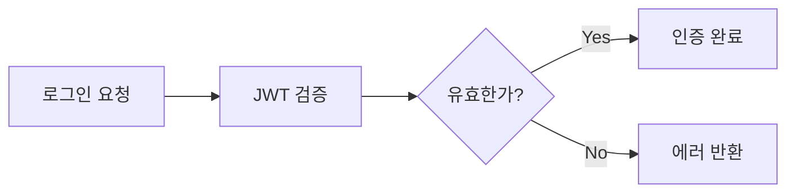

# CLAUDE.md

이 파일은 이 저장소에서 코드 작업 시 Claude Code (claude.ai/code)에게 가이드를 제공합니다.

## 문서

**완전한 문서는 `/docs` 폴더에서 확인할 수 있습니다:**

- **[README.md](./docs/README.md)** - 문서 개요 및 네비게이션
- **[개발 명령어](./docs/development-commands.md)** - 개발에 사용 가능한 모든 명령어
- **[아키텍처 개요](./docs/architecture.md)** - 시스템 아키텍처 및 설계 패턴
- **[새 기능 추가하기](./docs/adding-features.md)** - 기능 구현을 위한 단계별 가이드
- **[데이터베이스 가이드](./docs/database.md)** - 데이터베이스 설정, 마이그레이션 및 모범 사례
- **[프론트엔드 개발](./docs/frontend.md)** - React 프론트엔드 개발 가이드
- **[Docker 설정](./docs/docker.md)** - Docker 환경 설정 및 관리
- **[Claude Code 가이드](./docs/claude-code-guide.md)** - Claude Code 전용 종합 가이드

## 빠른 시작

### 개발 워크플로우
```bash
# 1. Docker 서비스 시작
cd docker && ./startDocker.sh

# 2. API 환경 설정
cd ../apps/api && yarn generateEnv

# 3. 데이터베이스 마이그레이션 실행
yarn migration:run

# 4. 개발 서버 시작
yarn dev  # 3000 포트에서 실행
```

### 주요 명령어
- `yarn dev` - API 개발 서버 시작 (apps/api)
- `yarn dev` - 프론트엔드 개발 서버 시작 (apps/backoffice)
- `yarn lint` - 모든 워크스페이스에서 린팅 실행
- `yarn test` - 테스트 실행
- `yarn migration:run` - 데이터베이스 마이그레이션 적용

## 아키텍처 요약

**Hybrid tRPC + NestJS 마이크로서비스 아키텍처:**
- **tRPC 애플리케이션**: 타입 안전한 엔드포인트를 가진 API 게이트웨이
- **NestJS 마이크로서비스**: 인메모리 통신을 사용하는 비즈니스 로직
- **통신**: 클라이언트 → tRPC Router → MicroserviceClient → EventBus → NestJS Controller → Service

**모듈 패턴:**
```
module/
├── module.router.ts      # tRPC 엔드포인트 (@Router 데코레이터)
├── module.controller.ts  # 메시지 핸들러 (@MessagePattern)
├── module.service.ts     # 비즈니스 로직
├── module.module.ts      # NestJS 모듈 설정
├── module.schema.ts      # Zod 스키마 정의
├── module.dto.ts         # DTO 타입 정의 (TypeScript interface)
└── module.middleware.ts  # 인증 (선택사항)
```

**메시지 규약:** 모든 내부 통신에 `moduleName.methodName` 사용

**모듈 구조 (예: Brand):**
```
brand/
├── brand.router.ts       # tRPC 엔드포인트 (@Router)
├── brand.controller.ts   # 메시지 핸들러 (@MessagePattern)
├── brand.service.ts      # 비즈니스 로직
├── brand.module.ts       # NestJS 모듈
├── brand.schema.ts       # Zod 스키마 정의
└── brand.dto.ts          # DTO 타입 정의
```

**⚠️ DTO 파일 패턴 (필수):**
- Service에서 사용하는 모든 DTO 타입은 `*.dto.ts` 파일에 정의
- Service 파일 내에서 interface 직접 정의 **금지**
- DTO는 TypeScript interface로 정의하여 type import 사용
- 파일명: `{moduleName}.dto.ts`

```typescript
// ❌ 잘못된 방법 - Service 파일에 직접 정의
// module.service.ts
interface CreateModuleInput {
  name: string;
  email: string;
}

export class ModuleService {
  async create(input: CreateModuleInput) { ... }
}

// ✅ 올바른 방법 - DTO 파일로 분리
// module.dto.ts
export interface CreateModuleInput {
  name: string;
  email: string;
}

export interface ModuleListResponse {
  data: Module[];
  total: number;
}

// module.service.ts
import type { CreateModuleInput, ModuleListResponse } from './module.dto';

export class ModuleService {
  async create(input: CreateModuleInput) { ... }
  async findAll(): Promise<ModuleListResponse> { ... }
}
```

## 필수 패턴

**타입 정의 및 공유 (packages/api-types):**
```typescript
// packages/api-types/src/module.ts
import { z } from 'zod';

// 스키마 정의 - nullish() 사용 (optional().nullable() 대신)
export const moduleSchema = z.object({
  id: z.number(),
  name: z.string(),
  email: z.string().email().nullish(), // undefined 또는 null 허용
  metadata: z.object({
    field: z.string().nullish(),
  }).nullish(),
  createdAt: z.date(),
});

// Input 스키마
export const createModuleInputSchema = z.object({
  name: z.string().min(1),
  email: z.string().email().nullish(), // Input도 nullish() 사용
});

// Update 스키마 - Create 스키마를 extends하여 일관성 유지
export const updateModuleInputSchema = createModuleInputSchema.extend({
  id: z.number(),
});

// 타입 추론
export type Module = z.infer<typeof moduleSchema>;
export type CreateModuleInput = z.infer<typeof createModuleInputSchema>;
export type UpdateModuleInput = z.infer<typeof updateModuleInputSchema>;
```

**strictNullChecks와 Nullish 타입:**
- `tsconfig.json`에서 `strictNullChecks: true` 설정으로 엄격한 null/undefined 체크
- `Nullish<T>` 타입 유틸리티로 Zod의 `nullish()`와 엔티티 타입 일치
- 엔티티의 nullable 필드는 `Nullish<T>` 타입 사용

```typescript
// ⚠️ Nullish 타입 올바른 import 경로
import { Nullish } from '@src/types/utility.type';

// Entity에서 사용
@Column({ type: 'varchar', nullable: true })
email: Nullish<string>;
```

**API에서 타입 사용:**
```typescript
// apps/api/src/module/module.schema.ts
import { z } from 'zod';

export const moduleSchema = z.object({
  id: z.number(),
  name: z.string(),
  email: z.string().email(),
  createdAt: z.date(),
});

export const createModuleInputSchema = z.object({
  name: z.string().min(1),
  email: z.string().email(),
});

// apps/api/src/module/module.type.ts
import { z } from 'zod';
import { moduleSchema, createModuleInputSchema } from './module.schema';

export type Module = z.infer<typeof moduleSchema>;
export type CreateModuleInput = z.infer<typeof createModuleInputSchema>;

// apps/api/src/module/module.controller.ts
import type { Module, CreateModuleInput } from './module.type';
import { moduleSchema } from './module.schema';

@MessagePattern('module.create')
async create(data: CreateModuleInput): Promise<Module> {
  const result = await this.moduleService.create(data);
  return moduleSchema.parse(result);
}
```

**프론트엔드에서 타입 사용:**
```typescript
// apps/backoffice/src/routes/module/index.tsx
import type { Module } from '@yestravelkr/api-types';

const { data: modules } = trpc.module.findAll.useQuery();
// modules는 자동으로 Module[] 타입
```

**새 라우터:**
```typescript
import { z } from 'zod';

// Router에서 필요한 상수만 별도 정의 (필요한 경우)
const ROLE_ENUM = ['ADMIN_SUPER', 'ADMIN_STAFF', 'PARTNER_SUPER', 'PARTNER_STAFF'] as const;
const roleEnum = z.enum(ROLE_ENUM);

@Router({ alias: 'moduleName' })
export class ModuleRouter extends BaseTrpcRouter {
  @UseMiddlewares(BackofficeAuthMiddleware)
  @Mutation({ 
    input: z.object({
      name: z.string().min(1, '이름은 필수입니다'),
      email: z.string().email('이메일 형식이 아닙니다'),
      role: roleEnum, // 필요한 경우에만 사용
    }),
    output: z.object({
      id: z.number(),
      message: z.string(),
    })
  })
  async create(
    @Ctx() ctx: BackofficeAuthorizedContext,
    @Input() input: { name: string; email: string; role?: string }
  ) {
    const output = await this.microserviceClient.send('moduleName.create', input);
    return output; // Controller에서 이미 검증됨
  }
}
```

**컨트롤러 핸들러:**
```typescript
@Controller()
export class ModuleController {
  @MessagePattern('moduleName.create')
  @Transactional
  async create(data: CreateModuleInput): Promise<Module> {
    const result = await this.moduleService.create(data);
    return moduleSchema.parse(result); // Zod로 응답 검증 및 포맷팅
  }
  
  @MessagePattern('moduleName.findAll')
  async findAll(): Promise<ModuleList> {
    const results = await this.moduleService.findAll();
    return moduleListSchema.parse(results); // 배열도 Zod로 파싱
  }
}
```

**인증:**
```typescript
@UseMiddlewares(BackofficeAuthMiddleware)
@Query({ output: z.object({}) })
protectedRoute(@Ctx() ctx: BackofficeAuthorizedContext) {
  // 인증된 사용자를 위해 ctx.admin 접근
}
```

**데이터베이스 트랜잭션:**
```typescript
@MessagePattern('module.transactionalOperation')
@Transactional
async performTransaction(data: any) {
  // 오류 시 롤백과 함께 트랜잭션으로 자동 래핑
}
```

**Repository 패턴:**
```typescript
// 1. Entity 파일에 Repository 함수 추가
export const getModuleRepository = (
  source?: TransactionService | EntityManager
) => getEntityManager(source).getRepository(ModuleEntity);

// 2. RepositoryProvider에 추가
get ModuleRepository() {
  return getModuleRepository(this.transaction);
}

// ❌ 잘못된 방법 - TypeOrmModule.forFeature() 사용
@Module({
  imports: [TypeOrmModule.forFeature([AdminEntity])],
  // ...
})

// ✅ 올바른 방법 - RepositoryProvider만 사용
@Module({
  // imports에 TypeOrmModule.forFeature() 없이
  providers: [AdminService, AdminRouter],
  // ...
})
export class AdminModule {}

// Service에서 RepositoryProvider를 통해서만 접근
constructor(private readonly repositoryProvider: RepositoryProvider) {}
// this.repositoryProvider.AdminRepository.find()
```

## 중요 사항

- **자동 발견**: 새 라우터는 자동으로 로드됩니다 (수동 등록 불필요)
- **⚠️ Router 등록 규칙**: Router 파일(`.router.ts`)은 **Module의 providers에 절대 넣지 않음**. AutoRouterModule이 자동으로 발견하고 로드함
- **타입 안전성**: 모든 입력/출력 검증에 Zod 스키마 사용
- **스키마 패턴**: 스키마는 `.schema.ts`에 정의, 타입은 `.type.ts`에서 `z.infer`로 추론
- **⚠️ Router 스키마 규칙**: Router 파일에서는 외부 스키마 import 금지. `z.object()`, `z.enum()` 등을 직접 사용하여 인라인으로 스키마 정의
- **⚠️ tRPC 데코레이터 Import 규칙**: Router 파일에서 `@Router`, `@Query`, `@Mutation`, `@Ctx`, `@Input`, `@UseMiddlewares` 등의 데코레이터는 **반드시 `'nestjs-trpc'` 패키지에서 import**. `'@src/module/trpc/trpc.decorator'`와 같은 로컬 경로는 존재하지 않으므로 사용 금지
- **응답 포맷팅**: Controller에서 수동 포맷팅 대신 `schema.parse()` 사용
- **⚠️ @Transactional 데코레이터 규칙**: `@Transactional` 데코레이터를 사용하는 Controller는 **반드시 constructor에서 `TransactionService`를 주입**받아야 함
- **모듈 구조**: BackofficeModule로 그룹화된 하위 모듈들 (Brand, Auth, Admin 등)
- **환경**: API 시작 전에 항상 `yarn generateEnv` 실행
- **포트**: tRPC 서버는 3000 포트에서 실행
- **데이터베이스**: Docker를 통한 PostgreSQL, TypeORM 마이그레이션으로 관리
- **⚠️ Entity 생성 위치**: 모든 Entity는 `apps/api/src/module/backoffice/domain/` 경로에 생성해야 함
- **Repository**: 새 Entity 생성 시 반드시 Repository 함수와 RepositoryProvider 등록 필요
- **⚠️ Repository 접근 규칙**: 모듈에서 `TypeOrmModule.forFeature()` 사용 금지. 오직 `RepositoryProvider`를 통해서만 Entity Repository에 접근
- **Soft Delete**: TypeORM의 soft delete가 기본 적용되어 있어 `where: { deletedAt: null }` 조건 불필요

## PostgreSQL INHERITS 패턴

**⚠️ 이 프로젝트는 PostgreSQL 네이티브 INHERITS를 사용하며, TypeORM의 상속 데코레이터는 사용하지 않습니다.**

### 아키텍처 결정

**PostgreSQL INHERITS (DB 레벨)** + **TypeScript 상속 (코드 레벨)** 조합 사용

- **DB 레벨**: PostgreSQL INHERITS로 테이블 구조 정의
- **ORM 레벨**: TypeORM의 `@TableInheritance`/`@ChildEntity` 데코레이터 **사용 금지**
- **코드 레벨**: TypeScript `extends`로 Entity 상속

### Entity 정의 패턴

**부모 Entity:**
```typescript
@Entity('product_template')
export class ProductTemplateEntity extends BaseEntity {
  @Column({
    type: 'enum',
    enum: PRODUCT_TYPE_ENUM_VALUE,
  })
  type: ProductTypeEnumType;

  // 공통 필드들...
  @Column()
  name: string;

  @Column({ name: 'brand_id' })
  brandId: number;
}
```

**자식 Entity:**
```typescript
@Entity('hotel_template')
export class HotelTemplateEntity extends ProductTemplateEntity {
  constructor() {
    super();
    this.type = ProductTypeEnum.HOTEL;
  }

  // 호텔 전용 필드들...
  @Column({ name: 'base_capacity', type: 'integer' })
  baseCapacity: number;

  @Column({ name: 'max_capacity', type: 'integer' })
  maxCapacity: number;
}
```

**⚠️ 금지 사항:**
```typescript
// ❌ 사용 금지 - TypeORM 상속 데코레이터
@TableInheritance({ column: { type: 'varchar', name: 'type' } })
@ChildEntity(ProductTypeEnum.HOTEL)

// ✅ 올바른 방법 - 데코레이터 없이 일반 상속만 사용
@Entity('hotel_template')
export class HotelTemplateEntity extends ProductTemplateEntity {
```

### Migration 패턴

```typescript
export class CreateProductTemplateMigration implements MigrationInterface {
  public async up(queryRunner: QueryRunner): Promise<void> {
    // 1. Enum 타입 생성
    await queryRunner.query(
      `CREATE TYPE "product_type_enum" AS ENUM('HOTEL', 'E-TICKET', 'DELIVERY')`
    );

    // 2. 부모 테이블 생성
    await queryRunner.query(
      `CREATE TABLE "product_template" (
        "id" SERIAL NOT NULL,
        "type" "product_type_enum" NOT NULL,
        "name" varchar NOT NULL,
        "brand_id" integer NOT NULL,
        "use_stock" boolean NOT NULL DEFAULT false,
        "created_at" TIMESTAMP NOT NULL DEFAULT now(),
        "updated_at" TIMESTAMP NOT NULL DEFAULT now(),
        "deleted_at" TIMESTAMP,
        CONSTRAINT "PK_product_template" PRIMARY KEY ("id")
      )`
    );

    // 3. 자식 테이블 생성 (INHERITS 사용)
    await queryRunner.query(
      `CREATE TABLE "hotel_template" (
        "base_capacity" integer NOT NULL,
        "max_capacity" integer NOT NULL,
        "check_in_time" time NOT NULL,
        "check_out_time" time NOT NULL,
        CONSTRAINT "PK_hotel_template" PRIMARY KEY ("id")
      ) INHERITS ("product_template")`
    );

    // 4. 외래키 제약조건 (부모/자식 각각 추가)
    await queryRunner.query(
      `ALTER TABLE "product_template" ADD CONSTRAINT "FK_product_template_brand"
       FOREIGN KEY ("brand_id") REFERENCES "brand"("id")`
    );

    await queryRunner.query(
      `ALTER TABLE "hotel_template" ADD CONSTRAINT "FK_hotel_template_brand"
       FOREIGN KEY ("brand_id") REFERENCES "brand"("id")`
    );
  }

  public async down(queryRunner: QueryRunner): Promise<void> {
    await queryRunner.query(`DROP TABLE "hotel_template"`);
    await queryRunner.query(`DROP TABLE "product_template"`);
    await queryRunner.query(`DROP TYPE "product_type_enum"`);
  }
}
```

### Service 조회 패턴

**부모 테이블 조회 (공통 필드만):**
```typescript
// ⚠️ QueryBuilder 사용 불가 - TypeORM이 자식 컬럼도 SELECT에 포함시킴
// ✅ Raw Query 사용 필수
async findAll(): Promise<ProductTemplateListResponse> {
  const dataQuery = `
    SELECT
      pt.id,
      pt.type,
      pt.name,
      pt.brand_id,
      pt.use_stock,
      pt.created_at,
      pt.updated_at,
      b.name as brand_name
    FROM product_template pt
    LEFT JOIN brand b ON b.id = pt.brand_id AND b.deleted_at IS NULL
    WHERE pt.deleted_at IS NULL
    ORDER BY pt.created_at DESC
    LIMIT $1 OFFSET $2
  `;

  const result = await this.repositoryProvider.ProductTemplateRepository.query(
    dataQuery,
    [limit, offset]
  );

  return result.map(row => ({
    id: row.id,
    type: row.type,
    name: row.name,
    brandName: row.brand_name,
    // ...
  }));
}
```

**자식 테이블 조회 (전체 필드):**
```typescript
// ✅ 자식 Repository 사용 - QueryBuilder 가능
async findHotelDetail(id: number): Promise<HotelTemplate> {
  const hotel = await this.repositoryProvider.HotelTemplateRepository
    .createQueryBuilder('hotel')
    .leftJoinAndSelect('hotel.brand', 'brand')
    .where('hotel.id = :id', { id })
    .getOne();

  return hotel;
}
```

### 핵심 규칙 요약

**✅ 올바른 방법:**
1. Migration에서 PostgreSQL INHERITS 사용
2. Entity에서 TypeScript extends만 사용 (데코레이터 제거)
3. 부모 테이블 조회 시 Raw Query 사용
4. 자식 테이블 조회 시 해당 Repository 사용

**❌ 금지 사항:**
1. `@TableInheritance` 데코레이터 사용
2. `@ChildEntity` 데코레이터 사용
3. 부모 Repository에서 QueryBuilder로 `find()`, `findAndCount()` 사용

**이유:**
- PostgreSQL INHERITS와 TypeORM의 `@TableInheritance`는 서로 다른 개념
- TypeORM이 자식 컬럼을 SELECT에 포함시키면 "column does not exist" 에러 발생
- Raw Query로 명시적으로 공통 컬럼만 조회해야 함

**장점:**
- PostgreSQL 네이티브 기능 활용 (성능 우수)
- 각 타입별 독립적인 테이블 관리
- nullable 필드 최소화
- 각 타입별 인덱스 최적화 가능

**실제 예시:**
- `product_template` (부모) → `hotel_template`, `delivery_template`, `eticket_template` (자식)

## Enum 네이밍 규칙

**Enum 정의 패턴:**
```typescript
// 1. Enum 값 배열 정의 (as const 필수)
export const ROLE_ENUM_VALUE = ['ADMIN_SUPER', 'ADMIN_STAFF', 'PARTNER_SUPER', 'PARTNER_STAFF'] as const;

// 2. Enum 타입 정의 (EnumType suffix 사용)
export type RoleEnumType = typeof ROLE_ENUM_VALUE[number];

// 3. Enum 객체 정의 (Record 형태, tree-shaking 지원)
export const RoleEnum: EnumType<RoleEnumType> = {
  ADMIN_SUPER: 'ADMIN_SUPER',
  ADMIN_STAFF: 'ADMIN_STAFF',
  PARTNER_SUPER: 'PARTNER_SUPER',
  PARTNER_STAFF: 'PARTNER_STAFF'
};

// 4. Zod 스키마 정의
export const roleEnumSchema = z.enum(ROLE_ENUM_VALUE);
```

**네이밍 규칙:**
- **값 배열**: `{NAME}_ENUM_VALUE` - 대문자 스네이크 케이스 + `_ENUM_VALUE` suffix
- **타입**: `{Name}EnumType` - 파스칼 케이스 + `EnumType` suffix
- **객체**: `{Name}Enum` - 파스칼 케이스 + `Enum` suffix
- **스키마**: `{name}EnumSchema` - 카멜 케이스 + `EnumSchema` suffix

**사용 목적:**
- `ENUM_VALUE`: Zod 스키마 생성 및 타입 추론에 사용
- `EnumType`: TypeScript 타입 정의에 사용
- `Enum`: 코드에서 실제 값 참조 시 사용 (예: `RoleEnum.ADMIN_SUPER`)
- `enumSchema`: 입력값 검증 및 API 스키마 정의에 사용

## 실제 구현 예시

**Brand 모듈**: 브랜드 파트너 관리
- **Router**: `@Router({ alias: 'backofficeBrand' })`
- **Endpoints**: `register`, `findAll`, `findById`, `update`
- **Schema**: 중첩 객체 (businessInfo, bankInfo) 포함
- **인증**: BackofficeAuthMiddleware 적용

**Admin 모듈**: 관리자 계정 관리
- **Router**: `@Router({ alias: 'backofficeAdmin' })`
- **Endpoints**: `findAll` (리스트 조회)
- **Schema**: adminListItemSchema (id, email, name, role)
- **인증**: BackofficeAuthMiddleware 적용

**Product 모듈**: 품목 관리 (TODO: API 구현 필요)
- **Router**: `@Router({ alias: 'backofficeProduct' })` (예정)
- **Endpoints**: `findAll`, `create`, `update`, `delete` (예정)
- **Schema**: 품목명, 브랜드, 연동여부, 재고관리 여부 (예정)
- **인증**: BackofficeAuthMiddleware 적용 예정

## 백오피스 프론트엔드 패턴

**기술 스택:**
- **React + Vite + TypeScript**: 빠른 개발 환경
- **TanStack Router**: 파일 기반 라우팅 시스템
- **Tailwind CSS + tailwind-styled-components**: 스타일링
- **tRPC + React Query**: 타입 안전한 API 통신
- **Zustand**: 전역 상태 관리

**폴더 구조:**
```
apps/backoffice/src/
├── components/
│   ├── auth/           # 인증 관련 컴포넌트
│   ├── form/           # 공통 폼 컴포넌트 (FieldWrapper 등)
│   ├── icons/          # SVG 아이콘 컴포넌트
│   ├── layout/         # 레이아웃 컴포넌트 (MajorPageLayout)
│   ├── navigation/     # 네비게이션 컴포넌트
│   └── ui/             # 공통 UI 컴포넌트
├── routes/             # 파일 기반 라우팅
│   ├── _auth/          # 인증된 사용자 레이아웃
│   │   ├── admin/      # 관리자 관리
│   │   │   └── _components/  # AdminList 컴포넌트
│   │   ├── brand/      # 브랜드 관리
│   │   │   └── _components/  # BrandList 컴포넌트
│   │   ├── campaign/   # 캠페인 관리
│   │   └── product/    # 품목 관리
│   │       └── _components/  # ProductList 컴포넌트
│   └── login.tsx       # 로그인 페이지
├── shared/             # 공통 유틸리티
│   ├── components/     # 공통 컴포넌트 (Table, EmptyState 등)
│   └── trpc/           # tRPC 클라이언트 설정
├── store/              # Zustand 스토어
│   └── authStore.ts    # 인증 상태 관리
└── utils/              # 유틸리티 함수
    └── upload.ts       # 파일 업로드 유틸리티
```

**스타일링 패턴:**
```typescript
import tw from 'tailwind-styled-components';

const Container = tw.div`
  flex 
  flex-col 
  h-screen 
  bg-gray-50
`;
```

**네비게이션 구조:**
- SVG 아이콘 사용 (폰트 이모지 대신)
- 그룹별로 구분된 메뉴 구조
- 액티브 상태 스타일링 지원

**컴포넌트 패턴:**
- **MajorPageLayout**: 주요 페이지의 공통 레이아웃 (제목, 설명, 헤더 액션)
- **Suspense + useSuspenseQuery**: React 18 Suspense 패턴으로 로딩 상태 관리
- **List 컴포넌트 분리**: 각 페이지의 테이블 로직을 별도 컴포넌트로 분리
- **EmptyState**: 데이터가 없을 때의 일관된 UI 패턴

**Suspense 패턴:**
```typescript
// 페이지 컴포넌트 (index.tsx)
function ProductPage() {
  return (
    <MajorPageLayout title="품목 관리" headerActions={<CreateButton />}>
      <Suspense fallback={<TableSkeleton columns={4} rows={5} />}>
        <ProductList />
      </Suspense>
    </MajorPageLayout>
  );
}

// List 컴포넌트 (_components/ProductList.tsx)
export function ProductList() {
  const [products] = trpc.backofficeProduct.findAll.useSuspenseQuery();
  // 테이블 및 EmptyState 로직
}
```

**디자인 가이드라인:**
- 포스타입/인스타그램 스타일의 미니멀한 UI
- 화이트/그레이 톤의 깔끔한 디자인
- 충분한 여백과 명확한 타이포그래피
- 호버 효과와 트랜지션 애니메이션

**신규 컴포넌트 작성 규칙:**
- **⚠️ 필수**: 모든 신규 컴포넌트는 **설명 주석**과 **Usage 예시**를 반드시 포함해야 함
- **설명 주석**: 파일 최상단에 컴포넌트의 목적과 기능을 간단히 설명
- **Props 주석**: Props 인터페이스에 각 속성에 대한 설명 추가
- **Usage 예시**: 파일 최하단에 실제 사용 예시 주석 작성

**예시:**
```typescript
/**
 * FileUpload - 파일 업로드 컴포넌트
 *
 * 이미지 파일을 업로드하고 미리보기를 제공하는 컴포넌트입니다.
 * 드래그 앤 드롭, 파일 크기 제한, 업로드 진행 상태를 지원합니다.
 */

import { useState, useRef } from 'react';

export interface FileUploadProps {
  /** 업로드된 파일의 URL */
  value?: string | null;
  /** 파일 업로드 완료 시 호출되는 콜백 */
  onChange: (url: string | null) => void;
  /** 에러 상태 표시 여부 */
  error?: boolean;
  /** 비활성화 상태 */
  disabled?: boolean;
  /** 허용되는 파일 타입 (예: "image/*", ".pdf") */
  accept?: string;
  /** 최대 파일 크기 (bytes) */
  maxSize?: number;
  /** 업로드 경로 */
  uploadPath?: string;
}

export function FileUpload({ ... }: FileUploadProps) {
  // 구현...
}

/**
 * Usage:
 *
 * <FileUpload
 *   value={imageUrl}
 *   onChange={(url) => setImageUrl(url)}
 *   accept="image/*"
 *   maxSize={5 * 1024 * 1024} // 5MB
 *   uploadPath="products"
 * />
 */
```

## Git 커밋 규칙

**커밋 메시지 형식:**
```
<PREFIX>: <커밋 메시지 내용>

- 상세 설명 1
- 상세 설명 2

🤖 Generated with [Claude Code](https://claude.ai/code)

Co-Authored-By: Claude <noreply@anthropic.com>
```

**커밋 메시지 Prefix:**
- `FEAT`: 새로운 기능 추가
- `CHORE`: 빌드 업무, 패키지 매니저 설정 등
- `STYLE`: 코드 스타일 변경 (포맷팅, 세미콜론 누락 등)
- `REFACTOR`: 코드 리팩토링
- `DOCS`: 문서 수정
- `FIX`: 버그 수정
- `TEST`: 테스트 코드 추가 또는 수정

**커밋 분리 전략:**
변경사항은 논리적이고 순차적으로 분리하여 커밋:
1. **의존성/패키지 변경**: package.json, yarn.lock 등
2. **설정 변경**: config 파일, 환경 변수 설정 등
3. **핵심 로직 구현**: 비즈니스 로직, 서비스, 컨트롤러 등
4. **라우터/API 엔드포인트**: Router, Controller 연결
5. **UI/프론트엔드**: 화면 구성, 컴포넌트 추가
6. **테스트**: 테스트 코드 추가
7. **문서화**: README, CLAUDE.md 등 문서 업데이트

**예시 - 기능 추가 시 커밋 순서:**
```bash
# 1. 패키지 추가
git add package.json yarn.lock
git commit -m "CHORE: S3 업로드 관련 패키지 추가"

# 2. 설정 추가
git add config/default.js src/config.ts
git commit -m "CHORE: AWS S3 설정 추가"

# 3. 서비스 구현
git add src/module/shared/aws/*
git commit -m "FEAT: S3 파일 업로드 서비스 구현"

# 4. API 엔드포인트 추가
git add src/module/upload/*
git commit -m "FEAT: 파일 업로드 API 엔드포인트 추가"
```

**예시:**
```bash
git commit -m "$(cat <<'EOF'
FEAT: 백오피스 브랜드 관리 페이지 추가

- 브랜드 리스트 페이지 생성
- 브랜드 생성 페이지 생성  
- 브랜드 상세/수정 페이지 생성
- 네비게이션에 브랜드 메뉴 추가

🤖 Generated with [Claude Code](https://claude.ai/code)

Co-Authored-By: Claude <noreply@anthropic.com>
EOF
)"
```

**주의사항:**
- 커밋 메시지는 한글로 작성
- 명확하고 구체적인 변경 내용 기술
- 여러 변경사항은 리스트로 정리
- pre-commit hook이 자동으로 lint와 prettier 적용
- 관련성 있는 파일들끼리만 묶어서 커밋
- 각 커밋은 독립적으로 빌드 가능해야 함
- **⚠️ Claude Code에서 커밋 지시 시**: 파일들은 이미 add되어 있다고 가정하고, commit 메시지만 작성해서 바로 commit 수행 (git add 단계 생략)

## Pull Request 작성 규칙

**템플릿 준수:**
- `.github/pull_request_template.md` 템플릿을 따라 PR 작성
- 각 섹션의 목적에 맞게 명확하게 작성

**작성 가이드라인:**

**1. 설명 섹션:**
- **최대 4~6문장**으로 간결하게 요약
- PR이 해결하는 문제와 접근 방식을 명확하게 설명
- 불필요한 세부사항은 생략하고 핵심만 전달

**2. 목표 섹션:**
- **최대 2문장**으로 간결하게 작성
- 이 PR의 핵심 목표만 명시
- 여러 목표가 있어도 가장 중요한 1~2개만 선택

**3. 변경사항 섹션:**
- 변경사항이 많을 경우 **가독성을 최우선**으로 고려
- 적절한 포맷 활용:
  - **Code block**: 파일 구조나 코드 스니펫 표시
  - **Mermaid 다이어그램**: 플로우, 아키텍처, 관계도 시각화
  - **테이블**: 많은 항목을 구조화하여 표시
  - **계층 구조**: 중첩 리스트로 관련 항목 그룹화

**예시 - Code Block 활용:**
```markdown
## 변경사항

### API 엔드포인트 추가
```typescript
// backofficeProduct.findAll
// backofficeProduct.create
// backofficeProduct.update
```

### 프론트엔드 페이지 구조
```
routes/_auth/product/
├── index.tsx              # 품목 리스트
├── create.tsx             # 품목 생성
└── _components/
    └── ProductList.tsx    # 리스트 컴포넌트
```
```

**예시 - Mermaid 다이어그램 활용:**
```markdown
## 변경사항

### 인증 플로우 개선

```

**예시 - 테이블 활용:**
```markdown
## 변경사항

| 모듈 | 추가된 엔드포인트 | 기능 |
|------|------------------|------|
| Product | findAll | 품목 리스트 조회 |
| Product | create | 품목 생성 |
| Product | update | 품목 수정 |
| Category | findAll | 카테고리 조회 |
```

**예시 - 계층 구조 활용:**
```markdown
## 변경사항

- **백엔드 (API)**
  - Product 모듈 추가
    - Router, Controller, Service 구현
    - Repository 패턴 적용
  - Category 모듈 개선
    - 계층형 구조 지원

- **프론트엔드 (Backoffice)**
  - 품목 관리 페이지 구현
    - 리스트, 생성, 수정 화면
  - 공통 컴포넌트 추가
    - TableSkeleton, EmptyState
```

**주의사항:**
- 너무 긴 리스트는 가독성을 해침 → 적절히 그룹화하거나 다이어그램 활용
- 중요한 변경사항만 포함, 사소한 코드 스타일 변경은 생략
- 코드 리뷰어가 이해하기 쉽도록 맥락 제공

**PR 생성 후 작업:**
- **⚠️ Claude Code에서 PR 생성 시**: PR 생성 후 자동으로 Chrome에서 PR 페이지를 열어 사용자가 바로 확인할 수 있도록 함
- macOS: `open -a "Google Chrome" "<PR_URL>"`
- 사용자 경험 개선을 위해 PR 생성과 동시에 브라우저에서 열기

## 타입 작성 가이드

**Zod 스키마 작성 규칙:**
- **nullish() 통일 사용**: `optional().nullable()` 대신 모든 곳에서 `nullish()` 사용
- **null/undefined 구분 안함**: API 통신에서 null과 undefined를 구분하지 않음
- **Update 스키마 패턴**: `updateSchema = createSchema.extend({ id: z.number() })`로 일관성 유지
- **PUT 방식 업데이트**: Update API는 모든 필드를 요구하는 PUT 방식으로 동작
- **중앙 집중식 관리**: 모든 스키마는 `packages/api-types`에서 정의
- **타입 추론**: 직접 타입 정의 대신 `z.infer<typeof schema>` 사용
- **strictNullChecks**: TypeScript 설정에서 `strictNullChecks: true`로 엄격한 타입 체크

**스키마 패턴:**
```typescript
// ✅ 좋은 예 - Create/Update 스키마 패턴
export const createUserInputSchema = z.object({
  name: z.string().min(1),
  email: z.string().email().nullish(),
  profileData: userProfileSchema.nullish(),
});

// Update 스키마는 Create를 extends하여 일관성 유지
export const updateUserInputSchema = createUserInputSchema.extend({
  id: z.number(),
});

export const userSchema = z.object({
  id: z.number(),
  name: z.string(),
  email: z.string().email().nullish(),
  profile: userProfileSchema.nullish(),
  createdAt: z.date(),
});

// ❌ 나쁜 예 - 별도로 정의하거나 optional() 사용
export const updateUserInputSchema = z.object({
  id: z.number(),
  name: z.string().min(1).optional(), // 비일관적
  email: z.string().email().optional().nullable(), // 비표준
});
```

**파일 구조:**
```
packages/api-types/src/
├── user.ts          # 사용자 관련 스키마
├── brand.ts          # 브랜드 관련 스키마
├── server.ts         # 자동 생성 파일 (수정 금지)
├── index.ts          # 모든 타입 export
├── .prettierignore   # server.ts 제외
└── .eslintignore     # server.ts 제외
```

**중요 규칙:**
- **⚠️ server.ts는 자동 생성 파일**: API에서 자동으로 생성되므로 **절대 직접 수정 금지**. Claude Code는 이 파일을 수정하지 않아야 함
- **Linting 제외**: server.ts는 prettier, eslint 적용 제외 (.prettierignore, .eslintignore에 등록됨)
- **타입 정의 위치**: 실제 스키마는 각 모듈별 파일에서 정의 (brand.ts, user.ts 등)
- **⚠️ 코드 포맷팅 규칙**: apps/api 폴더의 코드를 수정한 후에는 **반드시 `cd apps/api && yarn lint` 실행**하여 코드 스타일을 통일시켜야 함

특정 주제에 대한 자세한 정보는 `/docs` 폴더의 해당 문서 파일을 참조하세요.

## 중요 개발 지침

**⚠️ 지속적인 문서 업데이트 필수:**
- 새로운 기능 구현, 컴포넌트 추가, 아키텍처 변경 시 **반드시** CLAUDE.md와 관련 docs 업데이트
- 특히 백오피스 프론트엔드 패턴, 컴포넌트 구조, API 모듈 추가 시 문서화 필수
- 작업 완료 후가 아닌 **작업 중간중간마다** 문서 업데이트하여 최신 상태 유지
- 예시: 새 페이지 추가 → 즉시 폴더 구조 및 컴포넌트 패턴 섹션 업데이트

**문서 업데이트 타이밍:**
1. **새 모듈/페이지 추가 시**: 폴더 구조, 실제 구현 예시 섹션 업데이트
2. **컴포넌트 패턴 변경 시**: 백오피스 프론트엔드 패턴 섹션 업데이트  
3. **API 엔드포인트 추가 시**: 실제 구현 예시에 새 모듈 정보 추가
4. **아키텍처 변경 시**: 해당 섹션 즉시 업데이트