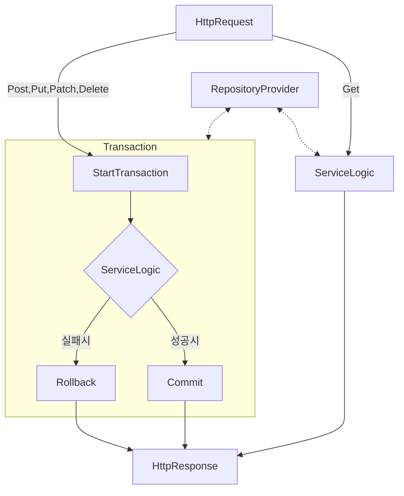

## RepositoryProvider

### RepositoryProvider의 목적

모든 Repository에 Write, Read 작업 시, RepositoryProvider를 통해 Repository에 접근해서 동작하도록 처리

Transaction은 Repository의 역할 중 일부로 보며 MainServiceLogic에선 Transaction에 대해 신경쓰지 않고 로직 작성할 수 있도록함

### Transaction 단위

Transaction의 관리 단위는 `Controller`에서 `Get`을 제외한 HttpMethod로 요청시,

해당 요청의 처음부터 끝까지 Transaction으로 관리하며
정상적으로 모든 로직을 성공했을 때만 Transaction을 Commit함

