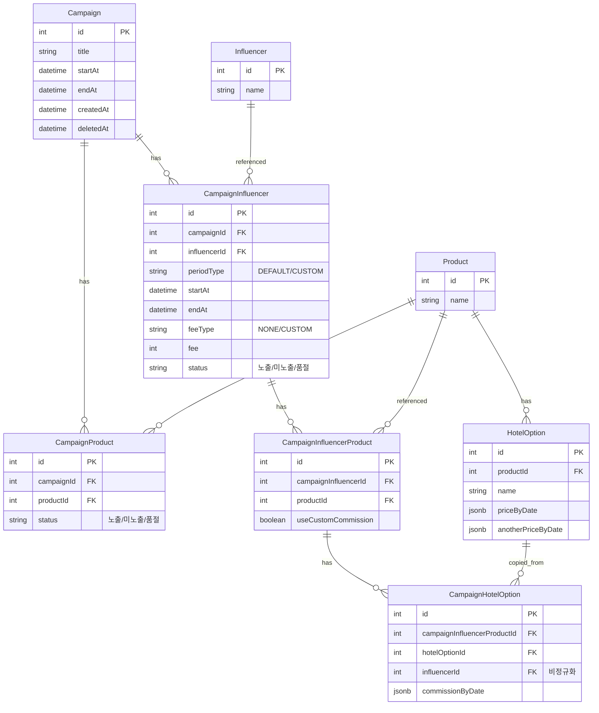

# Campaign 구조 설계

## 개요

인플루언서 마케팅 캠페인을 관리하기 위한 데이터베이스 구조 설계 문서입니다.

### 핵심 기능
- 캠페인별 상품 및 인플루언서 관리
- 인플루언서별 맞춤 수수료 설정
- 판매 링크 생성 및 주문 추적
- 정산 데이터 관리

### URL 구조
```
/influencer/{influencerId}                    → 인플루언서가 참여한 캠페인 목록
/influencer/{influencerId}/campaign/{campaignId}  → 해당 캠페인의 상품 목록
/sale/{campaignInfluencerProductId}           → 상품 상세 + 구매 페이지
```

---

## ERD



---

## 엔티티 상세

### 1. Campaign (캠페인)
기존 엔티티 유지, 관계만 추가

| 컬럼 | 타입 | 설명 |
|------|------|------|
| id | SERIAL | PK |
| title | VARCHAR | 캠페인명 |
| startAt | TIMESTAMPTZ | 시작일 |
| endAt | TIMESTAMPTZ | 종료일 |
| description | TEXT | 설명 (nullable) |
| thumbnail | VARCHAR | 썸네일 (nullable) |

### 2. CampaignProduct (캠페인-상품)
캠페인에 포함된 상품 목록. 상품 정보는 Product 참조 (원본 수정 시 반영)

| 컬럼 | 타입 | 설명 |
|------|------|------|
| id | SERIAL | PK |
| campaignId | INTEGER | FK → Campaign |
| productId | INTEGER | FK → Product |
| status | VARCHAR | 노출 상태 (VISIBLE/HIDDEN/SOLDOUT) |

**Unique**: (campaignId, productId)

### 3. CampaignInfluencer (캠페인-인플루언서)
캠페인에 참여하는 인플루언서. 인플루언서 정보는 Influencer 참조 (원본 수정 시 반영)

| 컬럼 | 타입 | 설명 |
|------|------|------|
| id | SERIAL | PK |
| campaignId | INTEGER | FK → Campaign |
| influencerId | INTEGER | FK → Influencer |
| periodType | VARCHAR | DEFAULT (캠페인 기간) / CUSTOM (직접 입력) |
| startAt | TIMESTAMPTZ | CUSTOM일 때 시작일 (nullable) |
| endAt | TIMESTAMPTZ | CUSTOM일 때 종료일 (nullable) |
| feeType | VARCHAR | NONE (없음) / CUSTOM (직접 입력) |
| fee | INTEGER | 진행비 (nullable) |
| status | VARCHAR | 노출 상태 (VISIBLE/HIDDEN/SOLDOUT) |

**Unique**: (campaignId, influencerId)

### 4. CampaignInfluencerProduct (인플루언서별 상품)
인플루언서별 상품 설정. 판매 링크 URL의 기준이 됨.

| 컬럼 | 타입 | 설명 |
|------|------|------|
| id | SERIAL | PK |
| campaignInfluencerId | INTEGER | FK → CampaignInfluencer |
| productId | INTEGER | FK → Product |
| useCustomCommission | BOOLEAN | 별도 수수료 사용 여부 |

**Unique**: (campaignInfluencerId, productId)

**URL**: `/sale/{id}` 형태로 판매 링크 생성

### 5. CampaignHotelOption (인플루언서별 호텔 옵션 수수료)
인플루언서별 호텔 옵션 커스텀 수수료. 기본값은 HotelOption.anotherPriceByDate 사용.

| 컬럼 | 타입 | 설명 |
|------|------|------|
| id | SERIAL | PK |
| campaignInfluencerProductId | INTEGER | FK → CampaignInfluencerProduct |
| hotelOptionId | INTEGER | FK → HotelOption (원본 참조) |
| influencerId | INTEGER | FK → Influencer (비정규화, 쿼리 편의) |
| commissionByDate | JSONB | 날짜별 수수료 `Record<string, number>` |

**참조 vs 복사**:
- `hotelOptionId`: 원본 HotelOption 참조 (name, priceByDate는 여기서 조회)
- `commissionByDate`: 커스텀 수수료만 저장

---

## 데이터 흐름

### 캠페인 생성 시
```
1. Campaign 생성
2. CampaignProduct[] 생성 (상품 추가)
3. CampaignInfluencer[] 생성 (인플루언서 추가)
4. CampaignInfluencerProduct[] 생성 (인플루언서별 상품 배정)
5. CampaignHotelOption[] 생성 (커스텀 수수료 설정 시)
```

### 판매 페이지 조회 시
```
GET /sale/{campaignInfluencerProductId}

1. CampaignInfluencerProduct 조회
2. Product 정보 JOIN (상품명, 가격 등)
3. HotelOption[] 조회 (옵션 목록)
4. CampaignHotelOption 조회 (커스텀 수수료 확인)
5. 최종 가격/수수료 계산하여 반환
```

### 주문 시
```
Order {
  campaignInfluencerProductId  // 누구를 통해 어떤 상품
  hotelOptionId                // 어떤 옵션

  // 스냅샷 (주문 당시 값 저장)
  price           // 판매가
  supplyPrice     // 공급가
  commission      // 수수료 (정산용)
}
```

**수수료 결정 로직**:
```typescript
// 1. 커스텀 수수료 확인
const customOption = await getCampaignHotelOption(
  campaignInfluencerProductId,
  hotelOptionId
);

// 2. 커스텀 있으면 커스텀, 없으면 기본값
const commission = customOption?.commissionByDate[date]
  ?? defaultHotelOption.anotherPriceByDate[date].commission;

// 3. Order에 스냅샷 저장
```

### 정산 시
```sql
SELECT
  ci.influencer_id,
  SUM(o.commission) as total_commission
FROM order o
JOIN campaign_influencer_product cip
  ON cip.id = o.campaign_influencer_product_id
JOIN campaign_influencer ci
  ON ci.id = cip.campaign_influencer_id
GROUP BY ci.influencer_id
```

---

## 참조 vs 복사 전략

| 데이터 | 전략 | 이유 |
|--------|------|------|
| 상품명, 브랜드 | 참조 | 원본 수정 시 반영 필요 |
| 인플루언서명 | 참조 | 원본 수정 시 반영 필요 |
| 상품 가격 (priceByDate) | 참조 | 원본 HotelOption에서 조회 |
| 캠페인 내 상태 | 저장 | 캠페인별로 다를 수 있음 |
| 인플루언서 기간/진행비 | 저장 | 인플루언서별로 다름 |
| 커스텀 수수료 | 저장 | 인플루언서별로 다름 |
| 주문 시 가격/수수료 | 스냅샷 | 정산 시점 기준 보장 |

---

## 기존 구조 변경사항

### Product 엔티티
- `campaignId` 컬럼 **제거**
- `campaign` 관계 **제거**

### 마이그레이션
```sql
-- Product에서 campaign_id 제거
ALTER TABLE "product" DROP CONSTRAINT IF EXISTS "FK_product_campaign";
ALTER TABLE "product" DROP COLUMN IF EXISTS "campaign_id";

-- PostgreSQL INHERITS 자식 테이블들
ALTER TABLE "hotel_product" DROP CONSTRAINT IF EXISTS "FK_hotel_product_campaign";
ALTER TABLE "delivery_product" DROP CONSTRAINT IF EXISTS "FK_delivery_product_campaign";
ALTER TABLE "eticket_product" DROP CONSTRAINT IF EXISTS "FK_eticket_product_campaign";
```

---

## 향후 확장

1. **배송/티켓 상품 옵션**: CampaignDeliveryOption, CampaignETicketOption
2. **참여 상태 관리**: CampaignInfluencer에 approvalStatus (대기/승인/거절)
3. **조회수/클릭수 추적**: CampaignInfluencerProduct에 viewCount, clickCount
4. **정산 상태**: Order에 settlementStatus (미정산/정산완료)
