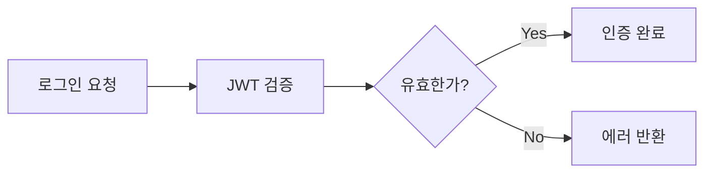

# Git 워크플로우 가이드

이 가이드는 YesTravel 프로젝트의 Git 커밋 규칙과 Pull Request 작성 규칙을 다룹니다.

## Git 커밋 규칙

### 커밋 메시지 형식

```
<PREFIX>: <커밋 메시지 내용>

- 상세 설명 1
- 상세 설명 2

🤖 Generated with [Claude Code](https://claude.ai/code)

Co-Authored-By: Claude <noreply@anthropic.com>
```

### 커밋 메시지 Prefix

| Prefix | 용도 |
|--------|------|
| `FEAT` | 새로운 기능 추가 |
| `FIX` | 버그 수정 |
| `CHORE` | 빌드 업무, 패키지 매니저 설정 등 |
| `STYLE` | 코드 스타일 변경 (포맷팅, 세미콜론 누락 등) |
| `REFACTOR` | 코드 리팩토링 |
| `DOCS` | 문서 수정 |
| `TEST` | 테스트 코드 추가 또는 수정 |

### 커밋 분리 전략

변경사항은 논리적이고 순차적으로 분리하여 커밋:

1. **의존성/패키지 변경**: package.json, yarn.lock 등
2. **설정 변경**: config 파일, 환경 변수 설정 등
3. **핵심 로직 구현**: 비즈니스 로직, 서비스, 컨트롤러 등
4. **라우터/API 엔드포인트**: Router, Controller 연결
5. **UI/프론트엔드**: 화면 구성, 컴포넌트 추가
6. **테스트**: 테스트 코드 추가
7. **문서화**: README, CLAUDE.md 등 문서 업데이트

### 커밋 예시

**기능 추가 시 커밋 순서:**

```bash
# 1. 패키지 추가
git add package.json yarn.lock
git commit -m "CHORE: S3 업로드 관련 패키지 추가"

# 2. 설정 추가
git add config/default.js src/config.ts
git commit -m "CHORE: AWS S3 설정 추가"

# 3. 서비스 구현
git add src/module/shared/aws/*
git commit -m "FEAT: S3 파일 업로드 서비스 구현"

# 4. API 엔드포인트 추가
git add src/module/upload/*
git commit -m "FEAT: 파일 업로드 API 엔드포인트 추가"
```

**HEREDOC을 사용한 커밋 메시지:**

```bash
git commit -m "$(cat <<'EOF'
FEAT: 백오피스 브랜드 관리 페이지 추가

- 브랜드 리스트 페이지 생성
- 브랜드 생성 페이지 생성
- 브랜드 상세/수정 페이지 생성
- 네비게이션에 브랜드 메뉴 추가

🤖 Generated with [Claude Code](https://claude.ai/code)

Co-Authored-By: Claude <noreply@anthropic.com>
EOF
)"
```

### 주의사항

- 커밋 메시지는 한글로 작성
- 명확하고 구체적인 변경 내용 기술
- 여러 변경사항은 리스트로 정리
- pre-commit hook이 자동으로 lint와 prettier 적용
- 관련성 있는 파일들끼리만 묶어서 커밋
- 각 커밋은 독립적으로 빌드 가능해야 함

## Pull Request 작성 규칙

### 템플릿 준수

- `.github/pull_request_template.md` 템플릿을 따라 PR 작성
- 각 섹션의 목적에 맞게 명확하게 작성

### 작성 가이드라인

#### 1. 설명 섹션
- **최대 4~6문장**으로 간결하게 요약
- PR이 해결하는 문제와 접근 방식을 명확하게 설명
- 불필요한 세부사항은 생략하고 핵심만 전달

#### 2. 목표 섹션
- **최대 2문장**으로 간결하게 작성
- 이 PR의 핵심 목표만 명시
- 여러 목표가 있어도 가장 중요한 1~2개만 선택

#### 3. 변경사항 섹션
- 변경사항이 많을 경우 **가독성을 최우선**으로 고려
- 적절한 포맷 활용

### 변경사항 표현 방법

#### Code Block 활용

```markdown
## 변경사항

### API 엔드포인트 추가
```typescript
// backofficeProduct.findAll
// backofficeProduct.create
// backofficeProduct.update
```

### 프론트엔드 페이지 구조
```
routes/_auth/product/
├── index.tsx              # 품목 리스트
├── create.tsx             # 품목 생성
└── _components/
    └── ProductList.tsx    # 리스트 컴포넌트
```
```

#### Mermaid 다이어그램 활용

```markdown
## 변경사항

### 인증 플로우 개선

```

#### 테이블 활용

```markdown
## 변경사항

| 모듈 | 추가된 엔드포인트 | 기능 |
|------|------------------|------|
| Product | findAll | 품목 리스트 조회 |
| Product | create | 품목 생성 |
| Product | update | 품목 수정 |
| Category | findAll | 카테고리 조회 |
```

#### 계층 구조 활용

```markdown
## 변경사항

- **백엔드 (API)**
  - Product 모듈 추가
    - Router, Controller, Service 구현
    - Repository 패턴 적용
  - Category 모듈 개선
    - 계층형 구조 지원

- **프론트엔드 (Backoffice)**
  - 품목 관리 페이지 구현
    - 리스트, 생성, 수정 화면
  - 공통 컴포넌트 추가
    - TableSkeleton, EmptyState
```

### 주의사항

- 너무 긴 리스트는 가독성을 해침 → 적절히 그룹화하거나 다이어그램 활용
- 중요한 변경사항만 포함, 사소한 코드 스타일 변경은 생략
- 코드 리뷰어가 이해하기 쉽도록 맥락 제공

## Claude Code 사용자를 위한 안내

### 커밋 시 주의사항

- **파일들은 이미 add되어 있다고 가정**하고, commit 메시지만 작성해서 바로 commit 수행 (git add 단계 생략)
- HEREDOC 형식으로 커밋 메시지 작성

### PR 생성 후 작업

- PR 생성 후 자동으로 Chrome에서 PR 페이지를 열어 사용자가 바로 확인할 수 있도록 함
- macOS: `open -a "Google Chrome" "<PR_URL>"`
