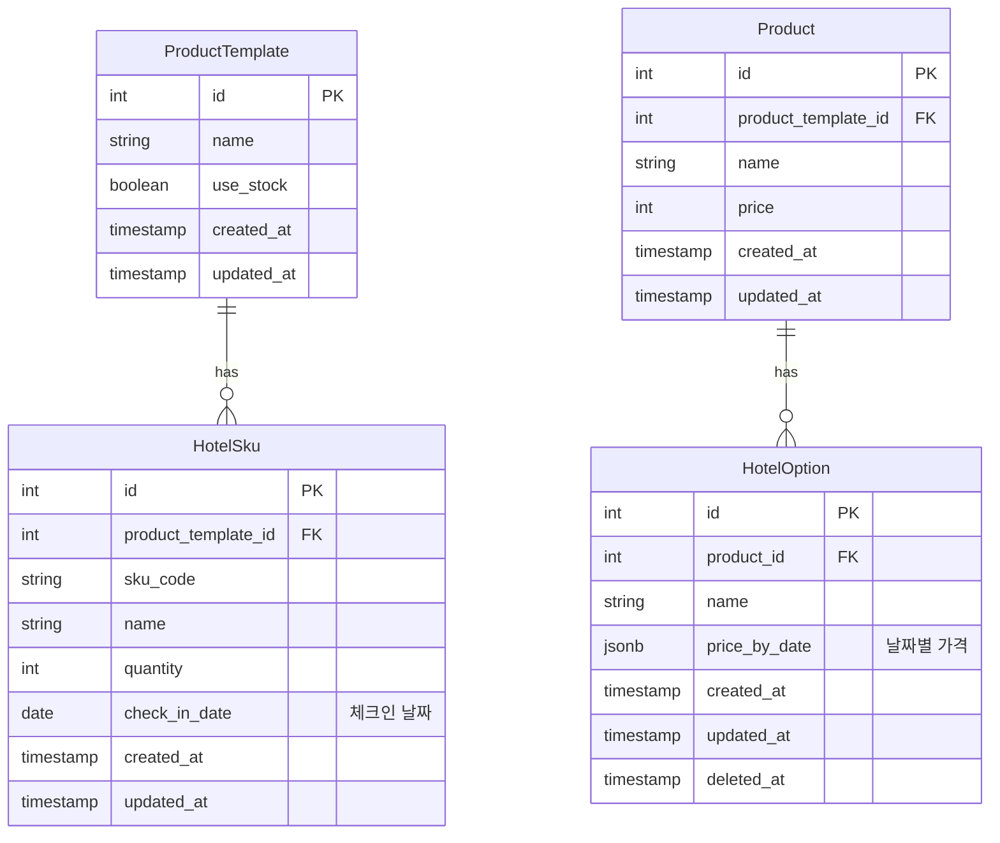

# 호텔 주문 구조

이 문서는 YesTravel 프로젝트의 호텔 상품 주문 시스템 구조를 설명합니다.

**← [결제/주문 구조로 돌아가기](./payment-order.md)**

## 개요

호텔 상품은 일반 상품과 달리 **날짜별 재고 관리**와 **날짜별 가격 변동**이 필요합니다. 이를 위해 별도의 엔티티 구조를 사용합니다.

**주요 특징:**
- 날짜별로 독립적인 재고 관리 (HotelSku)
- 날짜별로 다른 옵션 가격 적용 (HotelOption)
- 체크인 날짜 기준으로 관리 (체크아웃 날짜는 재고/가격 계산에서 제외)
- `@yestravelkr/option-selector` 패키지와 완전히 일치하는 구조

## ERD (Entity Relationship Diagram)



## 엔티티 설명

### HotelOption (호텔 옵션)

호텔 상품의 옵션을 정의하며, **날짜별로 다른 가격**을 적용할 수 있습니다.

**주요 필드:**
- `product_id`: 상품 ID (FK)
- `name`: 옵션명 (예: "조식 포함", "레이트 체크아웃")
- **`price_by_date` (JSONB)**: 날짜별 옵션 가격

**price_by_date 구조:**
```typescript
// DB에 저장되는 JSONB 구조
{
  "2025-01-15": 30000,
  "2025-01-16": 35000,
  "2025-01-17": 40000
}

// TypeScript 타입
priceByDate: Record<string, number>  // { "YYYY-MM-DD": price }
```

**특징:**
- 날짜 형식은 체크인 날짜 기준 (YYYY-MM-DD)
- 각 날짜마다 다른 가격 설정 가능
- 주말/평일, 성수기/비수기 등 유연한 가격 정책
- `@yestravelkr/option-selector`의 `HotelOption` 인터페이스와 완전히 일치

**HotelOption 인터페이스와의 일치:**
```typescript
// packages/option-selector/src/hotel/types.ts
export interface HotelOption {
  id: number;
  name: string;
  priceByDate: Record<string, number>;
}

// HotelOptionEntity는 이 인터페이스를 implements하여 구조 일치
@Entity('hotel_option')
export class HotelOptionEntity extends SoftDeleteEntity implements HotelOption {
  // ... 필드들이 HotelOption과 완전히 일치
}
```

**예시:**
```typescript
// 조식 옵션의 날짜별 가격
const breakfastOption: HotelOption = {
  id: 1,
  name: "조식 포함",
  priceByDate: {
    "2025-01-15": 15000,  // 평일
    "2025-01-16": 15000,  // 평일
    "2025-01-17": 20000,  // 주말
    "2025-01-18": 20000   // 주말
  }
};
```

### HotelSku (호텔 재고)

SkuEntity를 상속받아 **특정 날짜의 방 재고**를 관리합니다.

**주요 필드:**
- `product_template_id`: 상품 템플릿 ID (FK)
- `sku_code`: SKU 코드
- `name`: SKU 이름
- `quantity`: 재고 수량
- **`check_in_date` (DATE)**: 체크인 날짜

**인덱스:**
- `(product_template_id, check_in_date)`: UNIQUE - 같은 템플릿의 같은 날짜는 하나의 SKU만 존재
- `check_in_date`: 날짜별 조회 최적화

**특징:**
- 일반 SKU와 달리 `attributes` 사용 안함
- 날짜별로 독립적인 재고 관리
- 체크인 날짜 기준으로 관리 (체크아웃 날짜는 포함 안함)
- `@yestravelkr/option-selector`의 `HotelSku` 인터페이스와 완전히 일치

**HotelSku 인터페이스와의 일치:**
```typescript
// packages/option-selector/src/hotel/types.ts
export interface HotelSku {
  id: number;
  quantity: number;
  date: string; // YYYY-MM-DD
}

// HotelSkuEntity는 이 인터페이스를 implements하여 구조 일치
@Entity('hotel_sku')
export class HotelSkuEntity extends SkuEntity implements HotelSku {
  @Column({ name: 'check_in_date', type: 'date' })
  checkInDate: string;
  
  // date 프로퍼티는 checkInDate를 반환
  get date(): string {
    return this.checkInDate;
  }
}
```

**예시:**
```typescript
// 2025년 1월 15일 체크인 가능한 방 10개
const hotelSku: HotelSku = {
  id: 101,
  quantity: 10,
  date: "2025-01-15"  // checkInDate와 동일
};
```

## 호텔 주문 플로우

### 1. 재고 확인

고객이 체크인/체크아웃 날짜를 선택하면, 해당 기간의 모든 날짜(체크인 날짜만)에 재고가 있는지 확인합니다.

```typescript
// 예: 1월 15일 체크인, 1월 17일 체크아웃 (2박)
// 확인 대상: 2025-01-15, 2025-01-16 (체크아웃 날짜는 제외)

const checkInDate = "2025-01-15";
const checkOutDate = "2025-01-17";

// 체크인 날짜부터 체크아웃 전날까지의 SKU 조회
const requiredDates = ["2025-01-15", "2025-01-16"];

// 모든 날짜에 재고가 있어야 예약 가능
const allSkus = await hotelSkuRepository.find({
  where: {
    productTemplateId,
    checkInDate: In(requiredDates),
    quantity: MoreThan(0)
  }
});

if (allSkus.length !== requiredDates.length) {
  throw new Error("선택한 기간에 예약 가능한 방이 없습니다");
}
```

### 2. 옵션 선택 및 가격 계산

고객은 **1개의 호텔 옵션을 필수로 선택**하며, 각 날짜의 옵션 가격을 합산합니다.

```typescript
// 예: 조식 옵션 선택 (1월 15일~16일)
const selectedOption: HotelOption = {
  id: 1,
  name: "조식 포함",
  priceByDate: {
    "2025-01-15": 15000,
    "2025-01-16": 20000
  }
};

// 총 옵션 가격 = 15,000 + 20,000 = 35,000원
const totalOptionPrice = 
  selectedOption.priceByDate["2025-01-15"] +
  selectedOption.priceByDate["2025-01-16"];
```

### 3. 주문 생성 및 재고 차감

주문이 확정되면 해당 기간의 모든 SKU에서 재고를 차감합니다.

```typescript
// 각 날짜의 SKU에서 1개씩 차감
for (const date of requiredDates) {
  const sku = await hotelSkuRepository.findOne({
    where: { productTemplateId, checkInDate: date }
  });
  
  sku.quantity -= 1;
  await hotelSkuRepository.save(sku);
}
```

## 호텔 vs 일반 상품 차이점

| 구분 | 일반 상품 (Product) | 호텔 상품 (Hotel) |
|------|-------------------|------------------|
| **재고 관리** | Sku (attributes 기반) | HotelSku (날짜 기반) |
| **옵션 가격** | ProductOption (고정 가격) | HotelOption (날짜별 가격) |
| **선택 방식** | SkuSelector (속성 조합) | 날짜 범위 선택 |
| **재고 차감** | 선택한 SKU만 차감 | 기간 내 모든 날짜 차감 |
| **가격 계산** | 옵션 가격 1회 | 날짜별 옵션 가격 합산 |

## 패키지 구조

호텔 옵션 선택 로직은 `packages/option-selector/src/hotel`에서 관리합니다:

- `HotelOptionSelector`: 호텔 옵션 선택 관리 클래스
- `HotelSku`, `HotelOption`: 타입 정의
- FE/BE 모두에서 동일한 선택 로직 사용

**주요 특징:**
- **인터페이스 일치**: Entity와 패키지의 인터페이스가 완전히 일치하여 변환 불필요
- **체크아웃 날짜 처리**: 체크아웃 날짜는 재고/가격 계산에서 제외
- **필수 옵션 선택**: 호텔 옵션은 1개 필수 선택
- **날짜별 가격**: 날짜마다 다른 가격 적용 가능

**HotelOptionSelector 사용법:**
자세한 내용은 `packages/option-selector/src/hotel/README.md` 참조

---

**← [결제/주문 구조로 돌아가기](./payment-order.md)**
