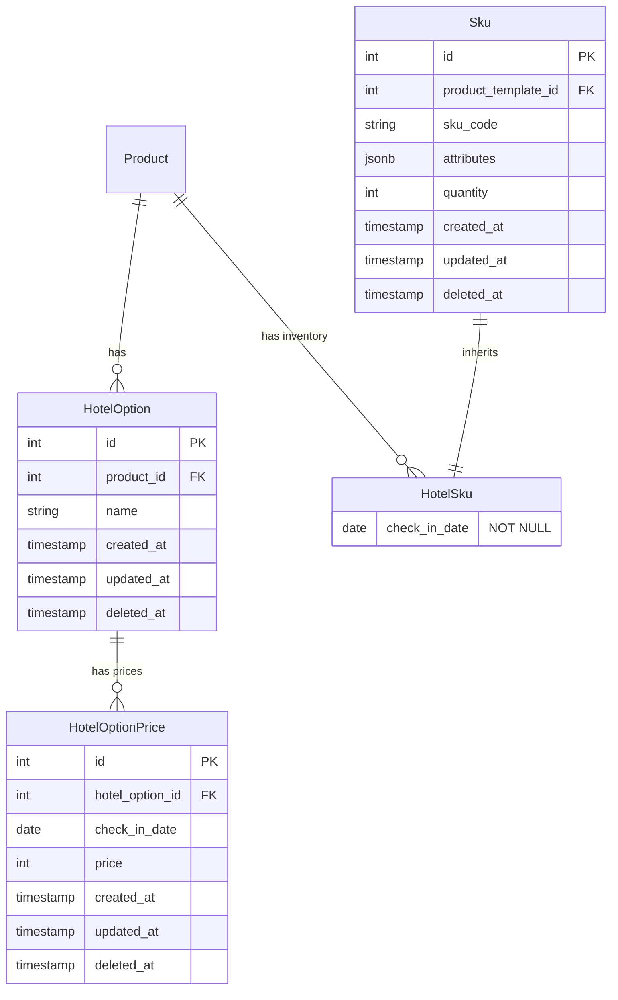

# 호텔 주문/결제 구조

## 개요

호텔 상품의 주문 및 결제 프로세스를 관리하기 위한 데이터 구조입니다.
기본 상품 구조(`payment-order.md`)와 달리 호텔 특성에 맞는 날짜 기반 가격 정책과 재고 관리를 지원합니다.

## ERD

## 테이블 설명

### HotelOption
호텔 객실의 옵션을 정의합니다. (예: 조식 포함, 조식 미포함 등)

**주요 컬럼:**
- `id`: 옵션 고유 ID
- `product_id`: 호텔 상품 ID (FK)
- `name`: 옵션명 (예: "조식 포함", "조식 미포함")

**특징:**
- 하나의 호텔 상품은 여러 옵션을 가질 수 있음
- 옵션별로 날짜에 따라 다른 가격 정책 적용 가능

### HotelOptionPrice
호텔 옵션의 날짜별 가격을 관리합니다.

**주요 컬럼:**
- `id`: 가격 정보 고유 ID
- `hotel_option_id`: 호텔 옵션 ID (FK)
- `check_in_date`: 체크인 날짜
- `price`: 해당 날짜의 가격

**특징:**
- `hotel_option_id`와 `check_in_date` 조합으로 UK (Unique Key) 설정
- 날짜별로 다른 가격 정책 적용 (성수기/비수기, 요일별 차등 등)
- 체크인 날짜 기준으로 가격 책정

### HotelSku
호텔 객실의 날짜별 재고를 관리합니다. 기존 `Sku` 테이블을 상속받아 확장합니다.

**추가 컬럼:**
- `check_in_date`: 체크인 날짜 (NOT NULL)

**상속받는 컬럼 (from Sku):**
- `id`: SKU 고유 ID
- `product_template_id`: 품목 템플릿 ID (FK)
- `sku_code`: SKU 코드
- `attributes`: 속성 정보 (JSONB) - 호텔에서는 미사용
- `quantity`: 재고 수량

**특징:**
- PostgreSQL INHERITS를 통해 `Sku` 테이블 상속
- 날짜별로 독립적인 재고 관리
- 체크인 날짜 기준으로 재고 차감
- `attributes`는 호텔에서 사용하지 않음 (일반 상품 옵션용)

## 호텔 예약 프로세스

### 1. 옵션 선택
- 고객이 체크인/체크아웃 날짜 선택
- 해당 기간의 재고(HotelSku) 확인
- 사용 가능한 옵션(HotelOption) 목록 표시
- 옵션별 총 금액 계산 (각 체크인 날짜별 HotelOptionPrice 합산)

### 2. 재고 확인
- 체크인 날짜부터 체크아웃 **전날**까지의 재고 확인
  - 예: 1/1 체크인, 1/3 체크아웃 → 1/1, 1/2 재고 확인
- 모든 날짜에 재고가 있어야 예약 가능

### 3. 주문 생성
- 선택한 옵션과 날짜 정보로 주문 생성
- 각 체크인 날짜별 HotelSku 재고 차감

### 4. 가격 계산
- 체크인부터 체크아웃 전날까지의 HotelOptionPrice 합산
- 총 금액 = Σ(각 날짜의 HotelOptionPrice)

## 주의사항

### 날짜 기준
- **모든 날짜는 체크인 날짜 기준**
- 체크아웃 날짜는 재고/가격 계산에 포함되지 않음
- 예: 2박 3일 (1/1 체크인, 1/3 체크아웃)
  - 재고 확인: 1/1, 1/2
  - 가격 계산: 1/1 가격 + 1/2 가격

### 재고 관리
- `HotelSku`는 `product_template_id`를 FK로 참조
- 같은 ProductTemplate로 만든 Product끼리는 재고 공유
- 날짜별 독립적인 재고 관리로 유연한 재고 운영

### 가격 정책
- 날짜별, 옵션별로 독립적인 가격 설정
- Unique Key로 중복 가격 정보 방지
- 가격 정보가 없는 날짜는 예약 불가

## HotelOptionSelector (Frontend/Backend 공통)

호텔 옵션 선택 로직은 `packages/option-selector/src/hotel`에 구현되어 있습니다.

**주요 기능:**
- 체크인/체크아웃 날짜 선택
- 선택 가능한 옵션 조회
- 재고 확인 및 총 금액 계산
- 상태 직렬화/역직렬화 (LocalStorage 등 저장용)

자세한 내용은 `packages/option-selector/src/hotel/README.md` 참조
