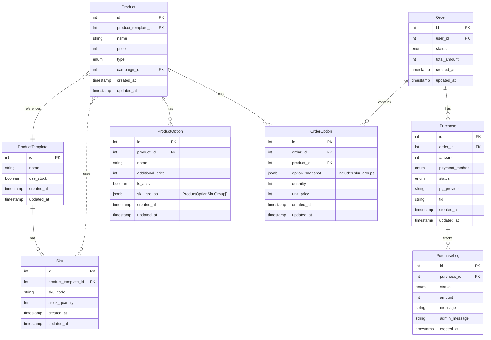

# 결제/주문 구조

이 문서는 YesTravel 프로젝트의 결제 및 주문 시스템 구조를 설명합니다.

## 개요

결제 시스템은 실제 비즈니스 로직과 분리되어 있으며, 추후 통합이 용이하도록 인터페이스 중심으로 설계되었습니다.

**주요 컴포넌트:**
- **Payment Service**: 결제 로직 처리 (API)
- **Shop Interface**: 사용자 주문 인터페이스 (Frontend)
- **Order System**: 주문 관리
- **Purchase System**: 구매 및 결제 이력 관리

## ERD (Entity Relationship Diagram)



## 설계 배경 및 원칙

### 1. 주문 시점 데이터 보존 (Snapshot 패턴)

**문제:**
ProductOption은 운영 중 언제든 변경될 수 있습니다 (옵션명 수정, 가격 조정 등). 이러한 변경이 이미 완료된 주문에 영향을 주면 안 됩니다.

**해결:**
주문 시점의 옵션 정보를 `OrderOption.option_snapshot`에 저장합니다.

**장점:**
- 주문 내역이 영구적으로 보존됨
- 과거 주문 조회 시 당시의 정확한 정보 확인 가능
- 가격 변경이 기존 주문에 영향 없음

**예시:**
```
시나리오:
1. 고객이 "오션뷰 (+30,000원)" 옵션으로 주문
2. OrderOption에 스냅샷 저장: { name: "오션뷰", price: 30000 }
3. 이후 관리자가 옵션 가격을 40,000원으로 인상
4. 기존 주문은 여전히 30,000원으로 표시됨 (스냅샷 덕분)
```

### 2. 다중 결제 지원 (1 Order : N Purchase)

**문제:**
주문 완료 후에도 다양한 이유로 추가 결제가 발생할 수 있습니다:
- 교환 (추가 금액 발생)
- 반품 후 재구매
- 배송비 추가 결제
- 옵션 추가 결제

**해결:**
하나의 Order에 여러 Purchase를 연결합니다.

**이유:**
PG사의 거래 내역과 데이터를 정확히 일치시켜야 합니다. **신규 결제가 발생할 때마다 새로운 Purchase를 생성**하여 PG사의 거래 내역과 1:1로 매칭합니다.

**중요:**
- **신규 결제**: 새로운 Purchase 생성 (PG사에 새 거래 발생)
- **취소/환불**: 기존 Purchase의 PurchaseLog에 기록 (PG사에서 취소 처리)

**예시:**
```
시나리오:
1. 최초 주문 결제: Purchase #1 (50,000원 결제)
   └─ PurchaseLog #1: amount=50000, "결제 승인"

2. 부분 취소: Purchase #1에 로그 추가 (새 Purchase 생성 안함)
   └─ PurchaseLog #2: amount=-20000, "고객 요청으로 부분 취소"

3. 추가 옵션 결제: Purchase #2 (10,000원 결제) - 신규 결제이므로 Purchase 생성
   └─ PurchaseLog #3: amount=10000, "추가 옵션 결제 승인"

결과:
- Order는 1개
- Purchase는 2개 (신규 결제만)
- 실제 결제 금액: 50,000 - 20,000 + 10,000 = 40,000원
```

### 3. 결제 이력 추적 (PurchaseLog)

**문제:**
- 결제/취소가 언제, 얼마나 발생했는지 추적 필요
- 관리자가 어떤 이유로 취소했는지 기록 필요
- 고객 문의 시 정확한 이력 제공 필요

**해결:**
Purchase의 모든 금액 변동을 PurchaseLog에 기록합니다.

**기록 내용:**
- **status**: 승인, 취소, 부분취소 등
- **amount**: 해당 거래의 금액
- **message**: PG사 응답 메시지
- **admin_message**: 관리자가 입력한 처리 이유

**사용 시나리오:**
1. **주문 상세 페이지**: PurchaseLog를 시간순으로 나열하여 결제 히스토리 표시
2. **고객 문의**: "환불이 언제 처리되었나요?" → PurchaseLog 확인
3. **정산**: Purchase별 PurchaseLog를 합산하여 최종 금액 계산
4. **감사 추적**: 모든 금액 변동의 근거 확인

**예시:**
```
Purchase #1 (최초 주문 결제 - PG거래 #1)
├─ PurchaseLog #1: status=APPROVED, amount=50000, "결제 승인"
└─ PurchaseLog #2: status=CANCELLED, amount=-20000, "고객 요청으로 부분 취소"
   (같은 Purchase에 기록, PG사에서 취소 처리)

Purchase #2 (추가 옵션 결제 - PG거래 #2)
└─ PurchaseLog #3: status=APPROVED, amount=10000, "추가 옵션 결제"
   (신규 결제이므로 새 Purchase 생성)

→ 최종 결제 금액: 50000 - 20000 + 10000 = 40000원
→ PG사 거래 건수: 2건 (Purchase 개수와 일치)
```

### 4. 데이터 무결성 원칙

**Order - Purchase 관계:**
- Order는 주문 전체의 상태를 관리
- Purchase는 PG사와의 개별 거래를 관리
- 둘은 독립적이면서도 연결되어 있음

**금액 계산:**
- Order.total_amount: 주문 총액 (OrderOption의 합계)
- Purchase.amount: 개별 거래 금액
- 실제 결제 금액 = Purchase들의 PurchaseLog 합산

**장점:**
- PG사 데이터와 100% 일치
- 복잡한 결제 시나리오 대응 가능
- 감사 추적 완벽 지원

## 엔티티 설명

### Product (상품)
상품의 기본 정보를 저장하는 엔티티입니다.

**관계:**
- `1:N` ProductOption (상품당 여러 옵션 가능)
- `1:N` OrderOption (주문 시 선택된 상품 추적)

**주요 필드:**
- 상품명, 브랜드, 카테고리
- 가격 정보
- 재고 관리 여부
- 상태 정보

### ProductOption (상품 옵션)
상품의 선택 가능한 옵션을 정의합니다.

**관계:**
- `N:1` Product (특정 상품에 속함)

**주요 필드:**
- 옵션명
- 추가 금액
- 활성화 상태
- **sku_groups (JSONB)**: ProductOptionSkuGroup 배열로 SKU 선택 규칙 정의

**SKU 그룹 구조:**
옵션은 여러 SKU 그룹을 가질 수 있으며, 각 그룹은 TypeORM Transformer를 통해 클래스로 변환됩니다.

```typescript
// DB에 저장되는 JSONB 구조
{
  "sku_groups": [
    {
      "name": "빵 선택",
      "selection_type": "FIXED",  // 고정 선택
      "items": [
        { "sku_id": 1, "quantity": 1 }  // 크루아상 1개 고정
      ]
    },
    {
      "name": "소스 선택",
      "selection_type": "CHOICE",  // 선택형
      "min_selections": 1,
      "max_selections": 1,
      "items": [
        { "sku_id": 2, "quantity": 1 },  // 딸기잼
        { "sku_id": 3, "quantity": 1 },  // 초코소스
        { "sku_id": 4, "quantity": 1 }   // 버터
      ]
    }
  ]
}

// TypeORM Transformer로 변환되는 클래스 구조
class ProductOptionSkuGroup {
  name: string;
  selection_type: 'FIXED' | 'CHOICE';  // 고정 또는 선택
  min_selections?: number;  // 최소 선택 수 (CHOICE일 때)
  max_selections?: number;  // 최대 선택 수 (CHOICE일 때)
  items: ProductOptionSkuGroupItem[];
}

class ProductOptionSkuGroupItem {
  sku_id: number;
  quantity: number;  // 해당 SKU의 수량
}
```

**예시 - 아이스크림 3개 골라담기:**
```json
{
  "sku_groups": [
    {
      "name": "아이스크림 선택",
      "selection_type": "CHOICE",
      "min_selections": 1,
      "max_selections": 3,  // 총 3개까지 선택 가능
      "items": [
        { "sku_id": 10, "quantity": 1 },  // 바닐라 (1개 단위)
        { "sku_id": 11, "quantity": 1 },  // 초콜릿 (1개 단위)
        { "sku_id": 12, "quantity": 1 },  // 딸기 (1개 단위)
        { "sku_id": 13, "quantity": 1 }   // 민트 (1개 단위)
      ]
    }
  ]
}
// 고객은 4가지 중에서 중복 가능하게 총 3개 선택
// 예: 바닐라 2개 + 초콜릿 1개
```

**예시 - 빵 + 소스 세트:**
```json
{
  "sku_groups": [
    {
      "name": "빵 (기본 포함)",
      "selection_type": "FIXED",
      "items": [
        { "sku_id": 20, "quantity": 1 }  // 크루아상 1개 고정
      ]
    },
    {
      "name": "소스 선택",
      "selection_type": "CHOICE",
      "min_selections": 1,
      "max_selections": 1,
      "items": [
        { "sku_id": 21, "quantity": 1 },  // 딸기잼
        { "sku_id": 22, "quantity": 1 },  // 초코소스
        { "sku_id": 23, "quantity": 1 }   // 버터
      ]
    }
  ]
}
// 빵은 고정으로 포함, 소스는 3가지 중 1개 선택
```

**주요 특징:**
- **FIXED 타입**: 자동 포함되는 SKU (선택 불가)
- **CHOICE 타입**: 고객이 선택 가능한 SKU 목록
- **중복 선택 지원**: max_selections 내에서 같은 SKU 중복 선택 가능
- **TypeORM Transformer**: DB의 JSONB를 자동으로 클래스로 변환/저장

### Sku (재고 관리 단위)
상품 템플릿(ProductTemplate)의 재고 관리 단위입니다.

**관계:**
- `N:1` ProductTemplate (특정 상품 템플릿에 속함)

**주요 필드:**
- sku_code: SKU 고유 코드 (product_template_id와 함께 unique)
- stock_quantity: 재고 수량
- attributes: 상품 속성 (색상, 사이즈 등)

**ProductTemplate과의 관계:**
SKU는 Product가 아닌 **ProductTemplate에 연결**됩니다. 이는 같은 ProductTemplate으로 만든 Product들이 **재고를 공유**할 수 있도록 하기 위함입니다.

**재고 공유 시나리오:**
```
예시:
1. ProductTemplate: "YesTravel 티셔츠" 생성
   └─ Sku #1: color=Blue, size=L, stock=100
   └─ Sku #2: color=Red, size=M, stock=50

2. Product #1 생성: "봄 시즌 티셔츠" (campaign_id=1)
   └─ 위 SKU들을 사용 가능

3. Product #2 생성: "여름 세일 티셔츠" (campaign_id=2)
   └─ 동일한 SKU들을 사용 가능

결과:
- Product #1과 #2는 다른 캠페인, 다른 가격
- 하지만 실제 재고(Sku)는 공유
- Sku #1의 재고가 10개 남으면, 두 상품 모두 해당 SKU는 10개만 판매 가능
```

**장점:**
- 물리적 재고는 하나지만, 여러 캠페인/이벤트에서 판매 가능
- 재고 관리 효율성 증대
- 실제 재고와 시스템 재고의 정확한 일치

### Order (주문)
고객의 주문 전체를 관리하는 엔티티입니다.

**관계:**
- `1:N` OrderOption (주문 내 여러 상품 포함 가능)
- `1:N` Purchase (주문에 대한 결제 이력 관리)

**주요 필드:**
- 주문자 정보 (user_id)
- 주문 상태 (대기, 확인, 완료, 취소)
- 총 금액
- 주문 날짜

### OrderOption (주문 옵션)
주문에 포함된 구체적인 상품과 옵션 정보입니다.

**관계:**
- `N:1` Order (특정 주문에 속함)
- `N:1` Product (어떤 상품인지 참조)

**주요 필드:**
- 선택된 옵션 정보 (스냅샷)
- 수량
- 단가

**스냅샷 이유:**
주문 시점의 옵션 정보를 보존하여, 이후 옵션 정보가 변경되어도 주문 내역은 유지됩니다.

### Purchase (구매/결제)
주문에 대한 실제 결제 정보를 관리합니다.

**관계:**
- `N:1` Order (특정 주문에 대한 결제)
- `1:N` PurchaseLog (결제 과정의 상태 변화 추적)

**주요 필드:**
- 결제 고유 ID
- 결제 방법 (카드, 계좌이체, 간편결제 등)
- 결제 금액
- 결제 상태 (대기, 완료, 실패, 환불)
- PG사 정보
- PG사 거래 ID (tid)

**결제 상태:**
- `PENDING`: 결제 대기
- `COMPLETED`: 결제 완료
- `FAILED`: 결제 실패
- `REFUNDED`: 환불 완료
- `PARTIALLY_REFUNDED`: 부분 환불

### PurchaseLog (결제 이력)
결제 건에서 발생한 모든 금액 변동 이력을 기록합니다.

**관계:**
- `N:1` Purchase (특정 결제에 대한 로그)

**주요 필드:**
- 결제 상태 (승인, 취소, 부분취소 등)
- 금액 (결제 또는 취소 금액)
- 메시지 (PG사 응답 메시지)
- 관리자 메시지
- 로그 시간

**사용 목적:**
- 결제/취소 금액 이력 추적
- 부분 취소 이력 관리
- 감사 추적 (audit trail)
- 고객 문의 대응

**예시:**
- 10,000원 결제 승인
- 3,000원 부분 취소
- 7,000원 잔액 (Purchase.amount에서 계산)


